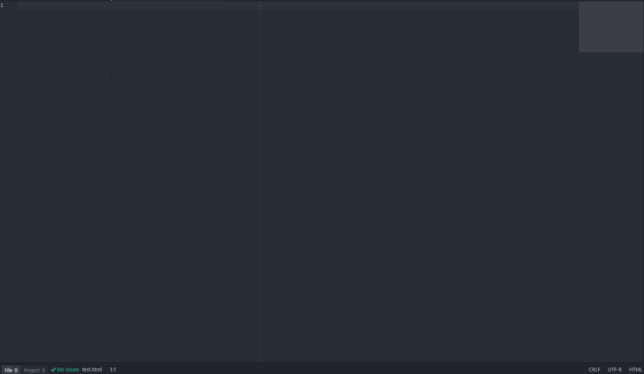

# DevLorem For Atom

Extremely small Atom Package that allows you to easily add [DevLorem](https://devlorem.kovah.de/p)
text from directly within Atom!  It's as simple as 1, or 2, or 3!

*Note: I did not create the DevLorem site, I simply created a small Atom package "wrapper."  Author of DevLorem is at http://kovah.de*

## Ways To Use This Package

* Use the keypattern: ctrl-alt-l
* Hit ctrl-shift-p and type in DevLorem:Generate (generally just Generate will show the resulting command)
* Use the context menu, right-click within atom and click "Insert DevLorem Text"

